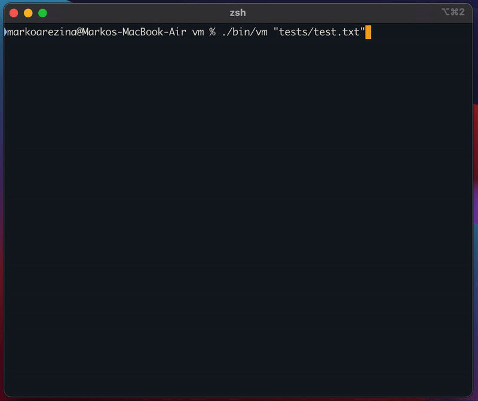

# vm

Vm is a Vim-like text editor.

## Supported Commands

```
a b cc c[any motion] dd d[any motion] f h i j k l n o p r s u w x yy y[any motion]
A F I J N O P R S X ^ $ 0 . ; / ?
^b ^d ^f ^g ^u
:w :q :wq :q! :r :0 :$ :line-number
q
@
```

## Demo



## Getting Started

```
make
./bin/vm "tests/test.txt"
```

## Overview

Vm was designed with the model view controller paradigm in mind and has 3 families of classes. Models, views, and commands.

At the highest level the views render the data stored in the text model. The controller parses the input to generate a command which is then applied to the text model. This process is demonstrated by the `render` method of the `TextModel`.

```c++
void TextModel::run() {
  while (render_loop_on) {
    render();
    apply(controller->parse_input());
  }
}
```

### Model

The model family only contains a single class, `TextModel`. The `TextModel` contains the core state of Vm. Some examples include current state of the text, cursor position, and write / command mode settings. These properties are accessed and mutated through getter and setter methods which power the the View and Command classes.

### View

Rendering is implemented using the ncurses library which allows for creating text based user interfaces. The views are stateless and solely responsible for displaying the state of the text model. Vm uses several windows to compose the entire view. These include the status bar at the bottom of the application and a view for the text being edited. The observer pattern is used to "subscribe" views to the `TextModel`. The `TextModel` stores the views as a vector of references to the `ViewBase` family of classes. The render loop calls the `draw` method of each view, as demonstrated in the implementation. 

```c++
void TextModel::render() {
  for (auto &v : views) {
    v->draw(this);
  }
}
```

The `TextModel` object passes itself to each view via the `this` pointer. This allows the views to access methods such as `get_lines`, `get_x`, and  `get_y`. The data is then drawn using a thin wrapper around  the ncurses library.

### Command

Each command or family of commands is implemented as a class. These commands take a reference to the text model and use its getter and setter methods to perform the intended effect. This may include changing the text or the position of the cursor. The interaction between the `TextModel` and commands follows the visitor pattern. This is demonstrated by the `apply` method of the `TextModel`:

```c++
void TextModel::apply(unique_ptr<CmdBase> cmd) {
  cmd->exec(this);
}
```

The `TextModel` passes itself to the `exec` method of each command via the `this` pointer similar to the views. This allows each command to use the getter and setter methods of the text model to perform an edit on the data based on the current state of the text.

The `Controller ` parses all user input. Its job is the determine which command or series of commands correspond to the character the user entered. The corresponding command of type `CmdBase` is then generated.

## Design

This section explores the design challenges, design tradeoffs, and flexibility of the chosen design.

### Text Model

The function of the `TextModel` is complex since it stores the state of the entire application. This includes the text being edited, cursor position, and all temporary state persisted between commands. To make the design more maintainable and to make use of separate compilation standalone states such a `History` (undo command), `Clipboard` (yank and paste), and `Macros` (macro recordings) where split off into their own classes. The `TextModel ` native methods  are focused on editing the text data while other state that needs to be persisted between complex commands can be added as a class focusing on managing a specific type of state, for example a macro recording or yanked lines. This makes the design more maintainable since if a new complex family of commands were to be added, a corresponding class would be created to manage their state and it could be added as another property to the `TextModel`. This would prevent changes from being made to the `TextModel`'s  core methods.

### Views

The ncurses is a C library. A this wrapper, `Window` manages the pointer to the ncurses `WINDOW` object and deletes the window in the destructor. `Window` can then safely be used by the `ViewBase` family of classes which have a smart pointer to the `Window` object. This ensures windows are cleared and deleted when they go out of scope. Additionally, composing the views using Window's methods make the design more flexible if ncurses would need to be replaced. A wrapper could be implemented around a new library (ie: ncurses 2.0) with the same methods as `Window` and the views would function as needed.

Interactions between views and the model follow the observer pattern. Views are subscribed to the `TextModel` and stored in a vector of `ViewBase` objects. Any number of new views can be subscribed making the design flexible. An instance of `ViewBase` implemented the `draw()` method. All the subscribed views are rendered by the `render()` method, as described in the outline, by calling the `draw()` method of each view.

### Commands

The `Controller` is responsible for parsing the user input and returning the appropriate command object from `parse_input()`.

`CmdBase` is the base class for all commands. The uml depicts how all commands inherit from `CmdBase` and can form additional hierarchies of commands. The interactions between commands and the model follow the visitor pattern. The model have an apply method taking an object of type `CmdBase`, implementing an `exec(in Model*)` method. A command 'visits' the model through it's `apply(in CmdBase)` method which then calls the `exec` method of the command passing itself in via the this pointer. The command can then perform any edit on the model using it's getter and setter methods.

This design is flexible, allowing for new commands to be added without adding methods to the `TextModel`. Commands can implement any complex edit, such as moving to a new location and deleting, clearing copying some amount of text, using the basic getter and setter methods provided but the `TextModel`.

Instead of adding editing methods to the `TextModel` complex families of commands, such as motion, can inherit from a base class implementing shared methods, such as `CmdMoveBase` which in turn inherits from `CmdBase`. The UML depicts this family of commands. Motion commands such as `w`, `dw` may move the cursor and perform an edit. `CmdMoveBase` implements methods to find the end position after the movement for example `h` or `w`. An instance of  `CmdMoveBase`, such as `CmdMove` or `CmdyY`, implement the logic for what to do with the text between the start position and end position. In the case of `CmdMove` nothing happens, the cursor just moves. While `CmdyY` copies the text to the `Clipboard`.

Commands that can be broken down into composition of previous commands, such as `:wq` (write and quite), can be implemented as instances of `CmdMultiCommand`. This class stores a vector of `CmdBase` objects which are added using the `add_command()` method. `CmdSaveExit` implements `:wq` as a composition of the existing write and quite commands as follows:

```c++
CmdSaveExit::CmdSaveExit() {
  add_command(make_shared<CmdSaveLines>());
  add_command(make_shared<CmdQuit>());
}
```

Additionally `CmdMultiCommand` makes macros and multipliers delightfully easy to implement. Multipliers simply form a `CmdMultiCommand` containing n instances of the command being multiplied. Macros record commands as a vector of `CmdBase` object. Each command in this vector can then be added to form an instance of `CmdMultiCommand` which executes the series of recorded commands.

```c++
void CmdPlayBackMacro::exec(TextModel *model) {
  model->apply(model->macros->generate_playback_command(letter));
}
```

Grouping multiplers and macros into a `CmdMultiCommand` simplifies undo functionality as well since history is recorded after the application of a command to the model. Since a series of commands in `CmdMultiCommand` is recorded as a single command in history they can be undone easily.

